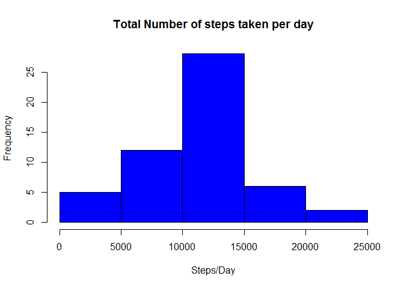
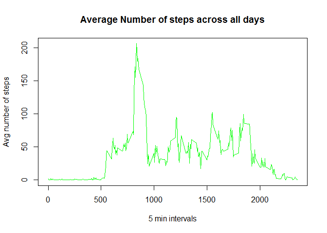
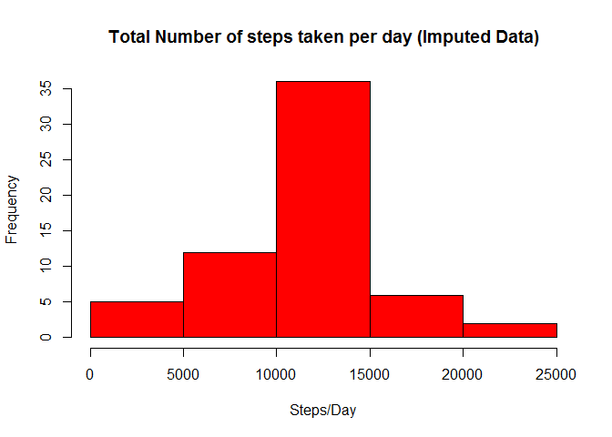

# Reproducible Research: Peer Assessment 1

# Reproducible Research Assignment 1

## Synopsis

This assignment makes use of data from a personal activity monitoring device, such as Fitbit, Nike Fuelband or Jawbone up. The data is collected throughout the day, in 5 min inetrvals. For the assigment we will analyze 2 months of data from an anonymous individual collected during the months of October and November, 2012 and include the number of steps taken in 5 minute intervals each day.

## Data

*Datset:* [Activity Monitoring Data](https://d396qusza40orc.cloudfront.net/repdata%2Fdata%2Factivity.zip)  
*Variables:*  
    1. **steps:** Number of steps taking in a 5-minute interval (missing values are coded as NA)   
    2. **date:** The date on which the measurement was taken in YYYY-MM-DD format   
    3. **interval:** Identifier for the 5-minute interval in which measurement was taken  

### Loading Preprocessing the data into R

```r
# Set the working directory
setwd("D:/DataScience/Reproducible Research/Assignment 1")

# Read the activity data
activity_data <- read.csv('activity.csv')
head(activity_data)
```

```
##   steps       date interval
## 1    NA 2012-10-01        0
## 2    NA 2012-10-01        5
## 3    NA 2012-10-01       10
## 4    NA 2012-10-01       15
## 5    NA 2012-10-01       20
## 6    NA 2012-10-01       25
```

```r
#Remove NA from the activity file
clean_activity_data <- na.omit(activity_data)
head(clean_activity_data)
```

```
##     steps       date interval
## 289     0 2012-10-02        0
## 290     0 2012-10-02        5
## 291     0 2012-10-02       10
## 292     0 2012-10-02       15
## 293     0 2012-10-02       20
## 294     0 2012-10-02       25
```

## Analysis of the data
### What is mean total number of steps taken per day?
Steps followed:  
 1. Calculate the total number of steps taken per day  
 2. Make a histogram of the total number of steps taken each day  
 3. Calculate and report the mean and median of the total number of steps taken per day
 

```r
# Aggregate steps in a day 
Agg_Step <- aggregate(steps ~ date, clean_activity_data, sum)

# Plot the histogram 
hist(Agg_Step$steps, main ="Total Number of steps taken per day", 
     xlab = "Steps/Day", col = "blue")
```

 

```r
#Get the mean total number of steps per day
mean(Agg_Step$steps)
```

```
## [1] 10766.19
```

```r
#Get the median total number of steps per day
median(Agg_Step$steps)
```

```
## [1] 10765
```


### What is the average daily activity pattern?
Steps followed: 
 1. Make a time series plot of the 5-minute interval and the average number of steps taken, averaged across all days 
 2. Find the row data which has the maximum average number of steps in an interval
 3. Get the interval for the maximun number of steps


```r
# Aggregate steps in a 5 min intervals 
Agg_interval <- aggregate(steps ~ interval, clean_activity_data, mean)

# Plot the times series graph 
plot(Agg_interval$interval, Agg_interval$steps, type = 'l', col = 'green',
     main = "Average Number of steps across all days",
     xlab = "5 min intervals",
     ylab = "Avg number of steps")
```

 

```r
#Row data which has the maximum average number of steps in an interval
max_steps <- which.max(Agg_interval$steps)

#Get the interval for the maximun number of steps
Agg_interval[max_steps, ]
```

```
##     interval    steps
## 104      835 206.1698
```
### Imputing missing values
Steps followed: 
 1. Calculate and report the total number of missing values in the dataset
 2. Devise a strategy for filling in all of the missing values in the dataset. 
 3. Create a new dataset that is equal to the original dataset but with the missing data filled in.
 4. Make a histogram of the total number of steps taken each day and Calculate and report the mean and median total number of steps taken per day.


```r
# Get the total number of NA in the dataset
NA_rows <- sum(is.na(activity_data))

#Replace NA by the mean for that 5 min interval
rep_na <- aggregate(steps ~ interval, clean_activity_data, mean)

#Perform imputation using for loop using the value from rep_na
for (i in 1:nrow(activity_data)) {
      if(is.na(activity_data$steps[i])){
            new_interval <- activity_data$interval[i]
            row <- which(rep_na$interval == new_interval)
            new_steps <- rep_na$steps[row]
            activity_data$steps[i] <- new_steps
      }
}

#new aggregate 
activity_data_imputed <- aggregate(steps ~ date, activity_data, sum)

#new histogram
hist(activity_data_imputed$steps, 
     main ="Total Number of steps taken per day (Imputed Data)", 
     xlab = "Steps/Day", col = "red")
```

 

```r
#get mean of the imputed data
mean(activity_data_imputed$steps)
```

```
## [1] 10766.19
```

```r
#get median of the imputed data
median(activity_data_imputed$steps)
```

```
## [1] 10766.19
```

#### *Analysis from the raw data vs the imputed data *  
      1. Mean - Since we used the mean to replace the NA, we see that the mean of the imputed data remains the same as the mean of the original data  
      2. Meadian - We see a small change in the median values of the imputed data compared to the median of the orginal data.
      

### Are there differences in activity patterns between weekdays and weekends?
Steps followed:  
 1. Create a new factor variable in the dataset with two levels - "weekday" and "weekend" indicating whether a given date is a weekday or weekend day.
 2. Make a panel plot containing a time series plot of the 5-minute interval (x-axis) and the average number of steps taken, averaged across all weekday days or weekend days (y-axis).
 

```r
# Convert the date 
activity_data$date <- as.Date(activity_data$date, "%Y-%m-%d")

#add a column for day of the week
activity_data$day <- weekdays(activity_data$date)

#create a vector for storing the day type - weekend or weekdays

day_type <- vector()
for (i in 1:nrow(activity_data)) {
      if (activity_data$day[i] == "Saturday" || 
                activity_data$day[i] == "Sunday"){
            day_type[i] <- "Weekend"
                }
      else day_type[i] <- "Weekday"
}

#add a column to store day type - weekday or weekend
activity_data$day_type <- day_type

#convert day_type to factor
activity_data$day_type <- as.factor(activity_data$day_type)

#aggregate steps 
stepsByDay <- aggregate(steps ~ interval+day_type, activity_data, mean)

#Provide meaningful names
names(stepsByDay) <- c("interval", "daytype", "steps")
      
#load library lattice for xyplot
library(lattice)
#Plot the data as a panel plot
xyplot( steps ~ interval | daytype, stepsByDay, 
        type = 'l', layout = c(1, 2),
        xlab = "Interval", ylab = "Number of Steps")
```

 
